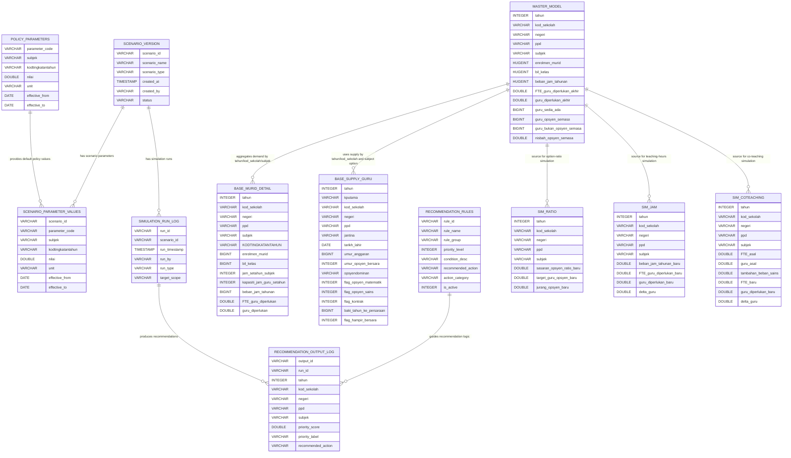
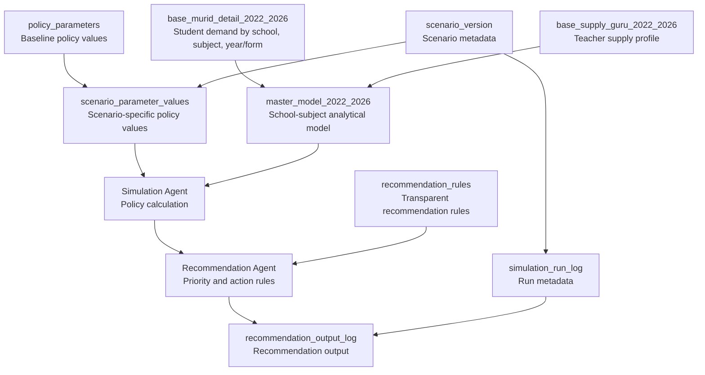

# Project ERD and Relational Scheme

## Project

Education Workforce Policy Simulation and Recommendation Agent

This document explains the main database entities, attributes, and logical relationships used by the agentic AI workforce planning project.

The schema is based on the DuckDB database:

```text
data/workforce_policy_agent_preclean_20260619_144113.duckdb
```

Important note: DuckDB does not enforce foreign keys in this MVP. The relationships below are **logical analytical relationships** used by the application and simulation engine.

## High-Level Entity Relationship Diagram



## Relational Scheme

### 1. Student Demand Detail

```text
base_murid_detail_2022_2026(
    tahun,
    kod_sekolah,
    negeri,
    ppd,
    subjek,
    KODTINGKATANTAHUN,
    enrolmen_murid,
    bil_kelas,
    jam_setahun_subjek,
    kapasiti_jam_guru_setahun,
    beban_jam_tahunan,
    FTE_guru_diperlukan,
    guru_diperlukan,
    snapshot_label,
    source_database
)
```

Suggested logical grain:

```text
tahun + kod_sekolah + subjek + KODTINGKATANTAHUN
```

Role:

Detailed teaching-demand table by year, school, subject, and year/form level.

### 2. Teacher Supply Profile

```text
base_supply_guru_2022_2026(
    tahun,
    kputama,
    kod_sekolah,
    negeri,
    ppd,
    jantina,
    tarikh_lahir,
    umur_anggaran,
    umur_opsyen_bersara,
    opsyendominan,
    kodstatusstaf,
    gredjawatanhakiki,
    gredpenyandangsemasa,
    jenis_pengisian,
    tarikhmula_kontrak,
    tarikhtamat_kontrak,
    tarikhtamat_perkhidmatan,
    guru_dlp,
    flag_opsyen_matematik,
    flag_opsyen_sains,
    flag_kontrak,
    baki_tahun_ke_persaraan,
    flag_hampir_bersara,
    snapshot_label,
    source_database
)
```

Suggested logical grain:

```text
tahun + kputama
```

Role:

Individual teacher supply profile table. The `kputama` field is anonymized into dummy IDs.

### 3. Master Analytical Model

```text
master_model_2022_2026(
    tahun,
    kod_sekolah,
    negeri,
    ppd,
    subjek,
    enrolmen_murid,
    bil_kelas,
    beban_jam_tahunan,
    FTE_guru_diperlukan_akhir,
    guru_diperlukan_akhir,
    guru_sedia_ada,
    guru_opsyen_semasa,
    guru_bukan_opsyen_semasa,
    nisbah_opsyen_semasa,
    snapshot_label,
    source_database
)
```

Suggested logical grain:

```text
tahun + kod_sekolah + subjek
```

Role:

Main modelling and simulation table. This is the key table used by the Random Forest forecasting component and policy simulation engine.

### 4. Policy Parameter Reference

```text
policy_parameters(
    parameter_code,
    subjek,
    kodtingkatantahun,
    nilai,
    unit,
    effective_from,
    effective_to,
    sumber_dokumen,
    catatan
)
```

Suggested logical grain:

```text
parameter_code + subjek + kodtingkatantahun + effective_from
```

Role:

Stores baseline or reference policy values.

### 5. Scenario Version

```text
scenario_version(
    scenario_id,
    scenario_name,
    scenario_type,
    description,
    created_at,
    created_by,
    status,
    notes
)
```

Suggested logical key:

```text
scenario_id
```

Role:

Stores scenario metadata.

### 6. Scenario Parameter Values

```text
scenario_parameter_values(
    scenario_id,
    parameter_code,
    subjek,
    kodtingkatantahun,
    nilai,
    unit,
    effective_from,
    effective_to,
    source_type,
    notes
)
```

Suggested logical grain:

```text
scenario_id + parameter_code + subjek + kodtingkatantahun
```

Role:

Stores parameter values used in a specific scenario.

### 7. Simulation Run Log

```text
simulation_run_log(
    run_id,
    scenario_id,
    run_timestamp,
    run_by,
    run_type,
    target_scope,
    notes
)
```

Suggested logical key:

```text
run_id
```

Role:

Records metadata for each simulation run.

### 8. Recommendation Output Log

```text
recommendation_output_log(
    output_id,
    run_id,
    tahun,
    kod_sekolah,
    negeri,
    ppd,
    subjek,
    priority_score,
    priority_label,
    recommended_action,
    reason_summary,
    created_at
)
```

Suggested logical key:

```text
output_id
```

Role:

Stores recommendation outputs produced by a simulation run.

### 9. Recommendation Rules

```text
recommendation_rules(
    rule_id,
    rule_name,
    rule_group,
    priority_level,
    condition_desc,
    recommended_action,
    action_category,
    notes,
    is_active
)
```

Suggested logical key:

```text
rule_id
```

Role:

Stores transparent rule-based recommendation logic.

### 10. Simulation Output Tables

These tables store precomputed or reference simulation outputs for 2026 policy scenarios.

```text
sim_ratio_2026(
    tahun,
    kod_sekolah,
    negeri,
    ppd,
    subjek,
    enrolmen_murid,
    bil_kelas,
    FTE_guru_diperlukan_akhir,
    guru_diperlukan_akhir,
    guru_sedia_ada,
    guru_opsyen_semasa,
    guru_bukan_opsyen_semasa,
    nisbah_opsyen_semasa,
    sasaran_opsyen_ratio_baru,
    target_guru_opsyen_baru,
    jurang_opsyen_baru
)
```

```text
sim_jam_2026(
    tahun,
    kod_sekolah,
    negeri,
    ppd,
    subjek,
    enrolmen_murid,
    bil_kelas,
    beban_jam_tahunan_baru,
    FTE_guru_diperlukan_baru,
    guru_diperlukan_baru,
    FTE_asal,
    guru_diperlukan_asal,
    delta_fte,
    delta_guru
)
```

```text
sim_coteaching_2026(
    tahun,
    kod_sekolah,
    negeri,
    ppd,
    subjek,
    FTE_asal,
    guru_asal,
    tambahan_beban_sains,
    tambahan_fte_sains,
    FTE_baru,
    guru_diperlukan_baru,
    delta_guru
)
```

Suggested logical grain:

```text
tahun + kod_sekolah + subjek
```

Role:

Stores simulation results or historical scenario references by school and subject.

## Main Analytical Flow



## Simplified Explanation for Stakeholders

The database can be understood as five main groups:

| Group | Tables | Meaning |
|---|---|---|
| Demand data | `base_murid_detail_2022_2026`, `master_model_2022_2026` | Shows how many students, classes, teaching hours, and teachers are needed. |
| Supply data | `base_supply_guru_2022_2026` | Shows available teachers, subject option, contract status, and retirement risk. |
| Policy data | `policy_parameters`, `scenario_parameter_values`, `scenario_version` | Stores baseline policy settings and scenario-specific changes. |
| Simulation data | `sim_ratio_2026`, `sim_jam_2026`, `sim_coteaching_2026`, `simulation_run_log` | Stores or supports policy simulation runs. |
| Recommendation data | `recommendation_rules`, `recommendation_output_log` | Stores rule-based recommendation logic and generated recommendations. |

## Relationship Summary

| Relationship | Join Logic | Explanation |
|---|---|---|
| `base_murid_detail_2022_2026` to `master_model_2022_2026` | `tahun + kod_sekolah + subjek` | Detail-level demand is aggregated into the master school-subject model. |
| `base_supply_guru_2022_2026` to `master_model_2022_2026` | `tahun + kod_sekolah`, with subject-option logic | Teacher supply supports school-subject demand and option-ratio analysis. |
| `scenario_version` to `scenario_parameter_values` | `scenario_id` | One scenario can contain many changed policy parameters. |
| `policy_parameters` to `scenario_parameter_values` | `parameter_code + subjek + kodtingkatantahun` | Scenario values are based on or override baseline policy parameters. |
| `scenario_version` to `simulation_run_log` | `scenario_id` | A scenario may be run multiple times. |
| `simulation_run_log` to `recommendation_output_log` | `run_id` | One simulation run may produce many recommendations. |
| `recommendation_rules` to `recommendation_output_log` | Rule logic, not enforced FK | Rules guide the actions written into recommendation outputs. |
| `master_model_2022_2026` to `sim_ratio_2026` | `tahun + kod_sekolah + subjek` | Option-ratio scenario output uses the master model as baseline. |
| `master_model_2022_2026` to `sim_jam_2026` | `tahun + kod_sekolah + subjek` | Teaching-hours scenario output uses the master model as baseline. |
| `master_model_2022_2026` to `sim_coteaching_2026` | `tahun + kod_sekolah + subjek` | Co-teaching scenario output uses the master model as baseline. |

## Notes for AI Developers

- Do not treat these relationships as enforced database constraints.
- The source database should normally be opened in read-only mode.
- `master_model_2022_2026` is the main table for forecasting and simulation.
- `base_murid_detail_2022_2026` is needed when simulation requires year/form-level workload.
- `base_supply_guru_2022_2026` contains sensitive teacher-level data and must be handled carefully.
- Recommendations are rule-based and require human review.
